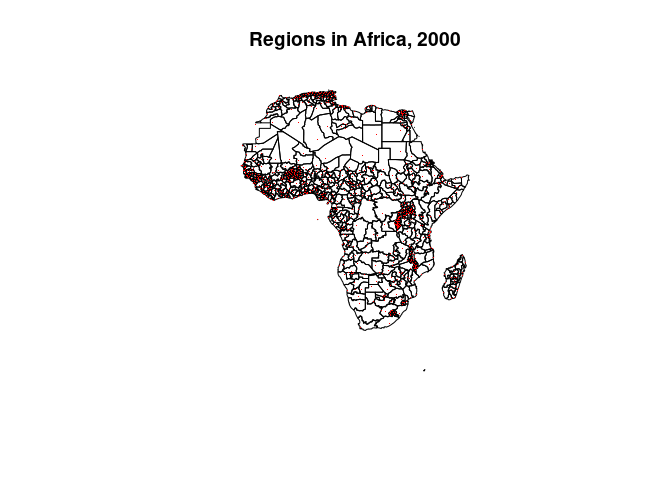
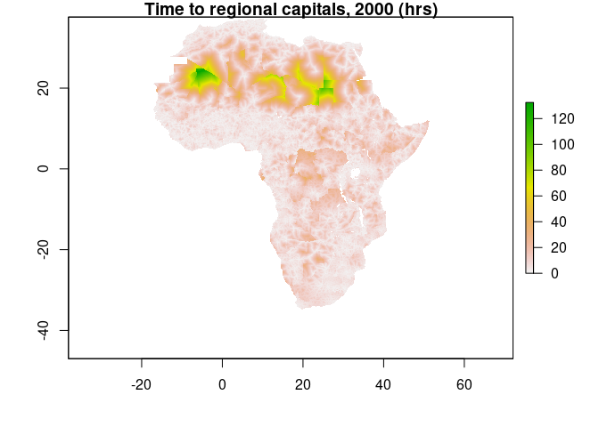

## Description

Prominent arguments hold that African states’ geography limits state
capacity, impedes public service provision, and slows economic
development. This repository contains comprehensive panel data on a
proxy of local state capacity, travel times to national and regional
capitals. These are computed on a yearly 5 x 5km grid using time-varying
data on roads (since 1966) and administrative units (1945–2016). The
road data has been digitized using a convolutional neural network from a
collection of Michelin maps that cover the African continent at 23
points in time since 1966. Data on administrative units, their capitals,
and borders has been self-collected, drawing on public sources such as
statoids.org, FAO’s GAUL database, and the GADM data.

**The data is also available for download from this Dropbox:**
<https://www.dropbox.com/sh/xsxhow5aslr5tnv/AADeSxh_9NC8cvlw-zKtXvh9a?dl=0>

See README.Rmd for details on how to load the data (in R).

When using the data, please cite the following publications and refer to
them for further details:

[Müller-Crepon, Carl. (2021) State Reach and Development in Africa since
the 1960s: New Data and Analysis. *Political Science Research and
Methods:* FirstView.](https://www.doi.org/10.1017/psrm.2021.60) 
(presents the main data) [Working Paper version here.](http://www.carlmueller-crepon.org/publication/state_reach_development/)

[Müller-Crepon, Carl, Philipp Hunziker & Lars-Erik Cederman (2021).
Roads to Rule, Roads to Rebellion: Relational State Capacity and
Conflict in Africa. *Journal of Conflict Resolution, 65*(2-3),
563-590.](https://journals.sagepub.com/doi/full/10.1177/0022002720963674)
(presents the original road digitization)

## Data

### 1st Level Administrative Units (a.k.a. Regions)

GIS data for 1st level administrative units of independent African
countries until 2016 are stored under
data/admin\_units/africa\_regions\_panel.GeoJSON . Each geometry
corresponds to one administrative unit which existed for a period
indicated by the start and end years.

### State reach measure

Because physical accessibility is a necessary (but not sufficient)
condition for state capacity, this data proxies local state reach via
the travel times to a locations’ national and regional capitals. Using
time-varying data on roads, administrative borders, and capitals, these
are computed yearly, for every ell on a 5 x 5km raster for all years
between 1945 and 2016. Note that all years before 1966 use the road
network as observed in 1966 for computing travel times.

Travel times based on time-varying road data are stored under
data/admin\_units/time2regcap\_1945\_2016\_dynroads.tif and
data/admin\_units/time2natcap\_1945\_2016\_dynroads.tif for times to
regional and national capitals, respectively. Data of the same format
but computed with time-invariant road networks as observed in 1966 are
stored here: data/admin\_units/time2regcap\_1945\_2016\_1966roads.tif
and data/admin\_units/time2natcap\_1945\_2016\_dynroads.tif. These are
multi-band .tif files where each band corresponds to one year, in
chronological order since 1945.

### Market Access Measures

Because these proxies for state reach correlate with (but are not the
same as) access to economic markets, gridded access measure to national
and Africa-wide markets are included under data/market\_access for all
years since 1940. These data are computed using time-variant road
networks (again, using those from 1966 for all years prior) and data
from Africapolis on the location and population of the 1530 biggest
cities and towns in Africa. These are all cities that ever reached more
then 50’000 inhabitants since 1950. Market access is computed using all
cities in the same country as a grid cell (national market access) or
all cities on the continent (international market access) using the
following formula from the economic literature:

$MA\_{p,t}=\\sum\_{m=1}^{M}c\_{p,m,t}^{-\\theta}\*P\_{m,t},$

where the market access of point *p* in year *t* is the sum of the
market potential *P* of a market *m* in year *t* multiplied by the
travel time between *p* and *m* calculated on the road network and
discounted by a trade elasticity *θ*. Because Donaldson (2018) and Eaton
& Kortum (2002) estimate different trade elasticity measures ($= $ 8.28
and 3.2 respectively), I construct the market access measure for both
parameters.

The data come as multi-band .tif files where each band corresponds to
one year, in chronological order since 1940. Again, I use the 1966 road
data for all years before that year.

## References

Donaldson, Dave. 2018. “Railroads of the Raj: Estimating the Impact of
Transportation Infrastructure.” American Economic Review
108(4-5):899–934.

Eaton, Jonathan and Samuel Kortum. 2002. “Technology, Gravity, and
Trade.” Econometrica 70(5):1741–1779.

**Feedback and Questions:** Please email [carl.muller-crepon at
politics.ox.ac.uk](mailto:carl.muller-crepon@politics.ox.ac.uk).

